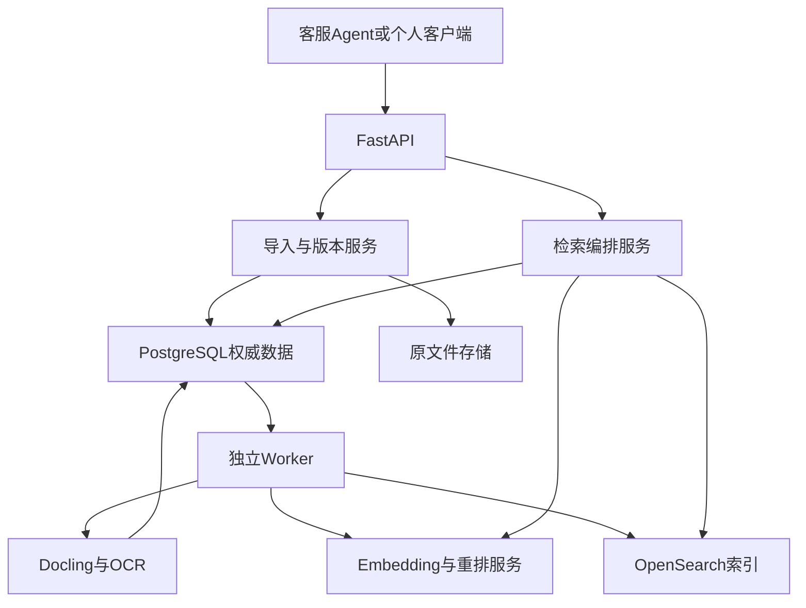
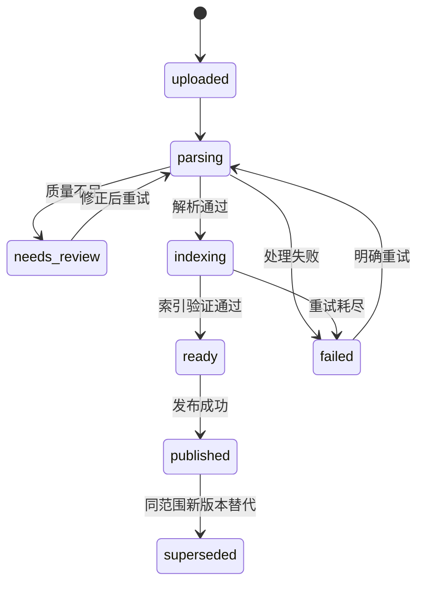

# CueKB · 线索知识库系统设计方案

版本：v0.1｜状态：ACCEPTED / IMPLEMENTATION_STARTED｜日期：2026-09-09。

本稿是已确认的编码输入基线，不代表所有模块已经实现。组件功能引用官方资料；结构、参数、容量与门槛属于设计建议，未经本项目实测。

## 1. 目标与范围

### 1.1 产品定义

CueKB是一套证据检索服务。输入自然语言问题与可信访问身份，输出排序后的原文证据、适用条件、来源定位及本次检索状态。快速、准确高于图谱规模或拟脑程度。

保留人脑启发的三个功能：多个线索定位同一内容；利用时间/项目/型号情境避免混淆；在明确需要时扩展关联。暂不模拟神经活动、自动遗忘、复杂记忆重组或自发推理。

### 1.2 两种用途

| 用途 | 内容 | 接入与运行 |
| --- | --- | --- |
| 生产客服 | 产品手册、故障知识、版本通告、处理流程 | 客服Agent通过API；发布与权限严格控制 |
| 个人知识库 | 导出的聊天、项目设计、决策记录、笔记 | 本地独立实例；后续提供门户；模型与解析均本地时可离线 |

共用核心实现，数据实例独立。首期不自动抓取聊天平台或IDE历史；通过文件导入，未来增加连接器。

### 1.3 首期与后续

首期：PDF/DOCX/MD/TXT、扫描PDF的OCR与质量状态、API、版本/权限、关键词/向量/RRF/重排、原文定位、轻量关系、更新删除、评测与监控。

后续：轻量Web门户、LLM回答、文档级ACL、外部平台同步、更复杂多跳查询。首期不做DOC旧格式、复杂图形理解、图片/视频语义检索、全自动知识图谱或生产故障动作执行。

## 2. 总体架构



采用模块化应用、独立后台进程，不提前拆成大量微服务。FastAPI与Worker共享领域模型；模型服务通过适配器调用，防止在线与批量工作抢占资源。

### 2.1 组件职责

| 组件 | 职责 | 不能承担的责任 |
| --- | --- | --- |
| PostgreSQL | 正文、元数据、可见版本、ACL、任务、关系、证据、发布事件 | 不把普通全文查询勉强替代专用中文检索 |
| OpenSearch | BM25、稠密向量、过滤与RRF；可重建搜索投影 | 不是权限/删除/发布状态的最终权威 |
| Docling | 解析、文档结构、内容块和来源锚点 | 不保证所有扫描表格都正确；质量需检测 |
| 模型服务 | Query/Chunk Embedding、有限候选重排 | 不对事实真假作保证；普通检索不用生成式LLM |
| 文件适配器 | 原文按哈希保存、授权下载、内容校验 | 不向客户端泄露实际内部路径 |
| Worker | 幂等处理入库和投影事件、租约与有限重试 | 不在HTTP请求内同步跑长时间OCR |

### 2.2 主选型

Python、FastAPI、Pydantic、SQLAlchemy、Alembic、PostgreSQL、OpenSearch、Docling。BGE-M3只使用稠密向量作为首个质量基线；bge-reranker-v2-m3为重排基线。具体兼容版本和模型修订在M0固定，禁止生产使用漂移的`latest`。

不另加向量数据库、Neo4j、Redis或消息队列。将来只有测量证明瓶颈或需求变化才引入。OpenSearch的公共混合过滤能力需选择兼容版本，不能复制与部署版本不符的API。

## 3. 领域数据模型

### 3.1 核心对象

| 对象/拟议表名 | 关键字段与约束 |
| --- | --- |
| knowledge_bases | id、名称、业务配置、acl_revision、content_revision |
| principals / api_keys / kb_grants | 身份、凭据哈希、知识库read/write/admin授权；不保存明文Key |
| documents | id、kb_id、逻辑文档名、deleted_at；不同修订共用逻辑文档ID |
| document_versions | id、document_id、原文hash、来源、业务版本、适用范围、状态、解析/分块配置版本 |
| document_publications | document_id、scope_key、active_version_id；每个适用范围唯一 |
| sections | id、version_id、parent_id、标题路径、顺序、完整内容 |
| chunks | id、section_id、version_id、原文文本、检索文本、token数量、来源锚点、content_hash |
| entities / entity_aliases | kb_id内实体ID、类型、规范名、别名及审核状态 |
| mentions | entity_id、chunk_id、文本位置；同名不自动跨知识库合并 |
| relation_assertions | 主体、关系、客体、条件、时间、状态；关系是否支持一跳查询 |
| relation_evidence | assertion_id、chunk_id、支持/反驳角色；关系至少有一条有效证据才作正式关联 |
| jobs / job_items | 阶段、租约、重试次数、幂等键、错误与进度 |
| outbox_events | 与内容变更同事务写入；消费者幂等执行派生更新 |
| index_generations | 模型修订、维度、归一化、分块版本、索引名和构建/激活状态 |
| audit_events / search_traces | 关键管理操作、检索阶段耗时、配置和诊断；默认不记录完整敏感正文 |

实体、文档、块使用稳定内部ID。不同文档具有相同正文时不合并权限边界；字节去重可在文件层发生，业务记录仍独立。

### 3.2 内容粒度

文档→章节→内容块。初始采用结构化小块，按段落/步骤/表格行组形成可独立理解的单元。初始目标每块约200—450模型tokens，包含标题前缀后原则上不超过512；参数通过样本调优。不是按汉字数硬切，也不是Embedding支持长输入就送整章。

保留完整父章节，命中后只补充必要条件/相邻步骤，限制每结果与总上下文长度。表格片段必须带表头、单位和行标识。OCR不确定、阅读顺序错误、表头丢失需要可见质量状态，不能静默发布。

`source_text`保持解析所得原文；`search_text`可增加标题和规范别名。自动生成关键词或描述不冒充原文；引用始终指向原始证据。

### 3.3 原文定位

PDF保留页码、区域坐标及坐标系；DOCX/MD/TXT保存标题路径、段落/行或字符定位；DOCX无稳定页码时不得伪造页码。多页块允许多个锚点。

### 3.4 适用范围

产品型号、软件版本、项目、有效起止时间与资料上传时间分开。版本用原始字符串加经过业务验证的规范字段，禁止简单字典序比较`1.10`和`1.9`。未知型号/版本不推测成硬过滤。

对于多条产品发布线，`scope_key`区分有效范围；不能把整个知识库所有文档只保留“最新一份”。范围重叠无法自动判定时返回歧义或按已审核发布规则处理。

## 4. 入库、发布与一致性

### 4.1 入库步骤

1. 校验上传身份、格式/大小、知识库权限和幂等键，保存原文件哈希及任务。
2. Worker领取租约，解析/必要OCR，保存结构化正文和锚点。
3. 进行空内容、乱码、页覆盖、表格结构等检查；失败或低质量进入`needs_review`，不发布。
4. 结构化分块，计算Embedding；保存编码配置，构建关键词与向量投影。
5. 建立结构关系、别名与可核验引用；首期不要求调用LLM抽取关系。
6. 验证索引可搜索、向量维度与模型一致、内容块数量与哈希匹配，进入`ready`。
7. 发布服务更新权威版本指针和内容修订号，写入outbox，驱动投影同步与缓存失效。

默认入库与发布分离。首期以知识库级发布操作控制正式可见范围；个人实例可配置“质量检查通过后自动发布”，不能绕过质量检查。

### 4.2 状态



删除是独立的文档可见性状态，优先级高于上述版本状态；不需要等待所有后台清理完成才停止返回。

### 4.3 发布协议

PostgreSQL与OpenSearch不存在跨库原子事务，采用可重试发布协议：

1. 为新版本写完整候选索引，等待refresh并验证能搜到；此时PG尚未指向新版本，最终校验不会返回它。
2. 新版本进入可召回集合时允许新旧索引短暂共存，按文档分组控制挤占，保留必要过取候选预算。
3. PG事务切换该scope的`active_version_id`，递增`content_revision`并记录outbox。只有完成前置可搜索验证才允许切换。
4. 后台将旧版本退出常规可召回集合；即使同步延迟，最终PG校验也不允许返回旧版本。
5. 每次查询保存初始修订号，最终在同一PG快照内校验所有候选。期间发生修订时最多重试一次；持续更新则返回`index_transition`降级和合法已有结果，不混用同一scope版本。

该方案保证不返回权威状态已失效内容，不能保证发布窗口召回与延迟完全不受影响。过滤造成候选不足时在预算内补取一次；禁止通过放宽权限或版本约束凑满top_k。

### 4.4 更新与删除

- 同幂等键＋相同payload返回原任务；相同键不同payload返回冲突。幂等键按身份和知识库作用域隔离。
- 同一逻辑文档相同文件hash和解析配置可复用结果；元数据变化仍触发权限/范围投影更新。
- 变化章节重新处理；首期允许按文件重解析，但不重建整个知识库。
- 模型或分块配置变化构建新索引generation。查询绑定一个完整generation，不能混用向量模型。新generation验证后切换并保留回退窗口。
- 删除/撤权先写PG权威状态、递增修订号，再异步清理索引、关系及缓存。所有返回与下载最终校验。
- 删除某证据时，仅撤销该支持记录；关系有其他有效证据则可保留。无支持的关系退出正式检索。
- 软删除用于立即隐藏和可控恢复；硬删除按保留策略清理所有派生副本。备份的到期清除单独记录，不宣称删除接口立即抹去所有历史备份。

### 4.5 Worker可靠性

任务采用租约和心跳，Worker故障后可重领；按至少一次执行设计，以版本ID＋阶段＋配置哈希去重。单阶段有限重试，指数退避，耗尽后failed。上传解析与在线Embedding/重排分队列或设资源配额，防止批量导入饿死查询。

## 5. 查询设计

### 5.1 请求入口

输入query、kb_ids、top_k、显式filters和mode。身份从可信凭据解析，不能信任客户端传入tenant_id/user_id作为权限。默认单轮检索；“那一个”“上次那个方案”需要调用方传递已确定上下文，否则返回需要澄清的状态，不偷偷用LLM猜测。

### 5.2 路由

| 模式 | 选择条件 | 行为 |
| --- | --- | --- |
| exact | 精确标题/错误码/标识符且含义足够明确 | keyword字段和BM25短路径；标识符歧义时不声称唯一命中 |
| hybrid | 默认自然语言 | BM25与向量并行、RRF、重排 |
| related | 显式请求依赖/影响/前后方案，且实体已解析 | hybrid＋有证据的一跳扩展 |
| auto | 调用方默认值 | 确定性规则选路径，无法确定用hybrid；路由规则需评测 |

精确查询不只是“识别到了错误码”就跳过其他条件。相同错误码在不同产品存在时，结合明确型号或返回分组和歧义。

### 5.3 普通查询步骤与初始参数

1. 解析身份、权限和显式范围；读取权威发布修订与索引generation。
2. 规范化空白/大小写（仅适用字段），识别保留原始形式的型号、错误码、单位。别名来自知识库审核词典。
3. BM25召回50；并行计算query向量后向量召回50。两路共享权限、可见范围和删除过滤。
4. RRF融合，按chunk ID去重，保留30个待重排候选。完全相同证据可合并显示多个来源，不能跨权限复用正文。
5. 仅related路径从有限高排名实体扩展一跳，最多新增20个证据块；标准路径候选上限30，关联路径重排总上限50。
6. 重排输入query＋必要业务上下文及候选正文。单对输入初始上限1024tokens，按实际模型Tokenizer计数；不静默截断末尾关键条件，超长候选需要重新分块或滑窗评分。
7. 返回默认8个、最多20个证据结果；合并同章节重叠片段，按需要补前提或表头。补充内容也需权限/版本校验。初始单结果总正文上限1200tokens，总输出证据上限6000tokens。
8. PG最终校验与证据状态评估；返回完整trace_id、状态和来源。

以上均为配置值，不是最佳值。模型输入长度、top_k和上下文预算共同影响延迟与质量；依据消融结果调整。

### 5.4 排序与过滤

OpenSearch建立标题、标题路径、正文等text字段；型号、错误码、接口名、文档ID、版本等保留keyword字段。中文分词插件与行业词典在M0确认兼容性并锁定，不把中文直接空格切词。

RRF只融合排名，不把BM25分数和余弦分数直接相加。最终排序主要用重排相关性；权威来源/状态是明确且可解释的约束或受控特征，不用无限权重掩盖不相关结果。历史查询放宽版本范围必须显式请求，但权限不变。

### 5.5 轻量关系

首期正式关系包括belongs_to、adjacent_to、alias_of、revises、replaces、references，以及有证据且通过校验的depends_on/applies_to。结构与版本关系用规则生成，业务依赖允许导入或人工维护。

相似文本只是召回线索，不能自动变为因果/依赖关系。关系扩展必须回到原文，按问题的关系类型、时间和方向筛选，限制一跳/数量/时间。对“全部影响范围”明确`scope_limited=true`，不得将受限一跳结果标为完整。

### 5.6 超时与降级

| 故障 | 行为 |
| --- | --- |
| Embedding或向量检索超时/模型不匹配 | 返回BM25合法候选，标记vector_unavailable |
| 重排超时 | 返回RRF合法结果，标记rerank_unavailable |
| 关联超时 | 返回标准检索结果，标记relation_timeout及scope_limited |
| OpenSearch不可用 | 返回503，不冒充正常无结果 |
| 身份/PG最终权限校验失败 | 拒绝返回内容，不能以缓存绕过 |
| 无合法候选 | 返回空列表与not_found状态，区分后端故障 |

采用请求总deadline并向下游传播剩余预算。并行子任务取消或释放后仍监控资源，避免超时但后台继续无限积压。设模型并发、队列长度和429过载响应；不会通过无限排队保住表面成功率。

### 5.7 证据与置信

`evidence_status`可为unassessed、sufficient、insufficient、conflicting；`retrieval_status`可为ok、degraded、not_found、needs_clarification；两者独立。未标定的模型分数不能使状态自动变成sufficient。

M4用独立验证集标定低证据门槛，评估误报和漏报。冲突检测首期仅保证发现结构化适用范围冲突/已标记矛盾，不保证自动识别所有自然语言事实矛盾。响应显式提供assessment_method与conflict_check_scope。

## 6. API契约提案

### 6.1 接口集合

| 方法与路径 | 功能 | 首期 |
| --- | --- | --- |
| POST /v1/knowledge-bases | 创建知识库 | 是 |
| POST /v1/documents | multipart上传文件和元数据；返回202任务ID | 是 |
| POST /v1/documents/{id}/versions | 上传同一逻辑文档的新版本 | 是 |
| GET /v1/jobs/{id} | 当前阶段、进度、错误码和可重试性 | 是 |
| POST /v1/documents/{id}/publish | 指定version_id及适用scope，发布ready版本 | 是 |
| GET /v1/documents/{id} | 元数据、允许访问的版本与原文入口 | 是 |
| GET /v1/documents/{id}/source | 经授权下载指定版本原文；不暴露存储路径 | 是 |
| DELETE /v1/documents/{id} | 立即隐藏并启动清理 | 是 |
| POST /v1/search | 证据检索 | 是 |
| GET /v1/entities/{id}/relations | 有权限的关系与证据，一跳 | 是 |
| POST /v1/answer | 可选生成回答，复用search证据 | 后续 |

API使用OpenAPI描述。写入支持Idempotency-Key；未授权资源根据统一策略返回404或403，避免泄露存在性。400/422输入问题，401凭据问题，409版本/幂等冲突，429过载，503后端不可用，均返回稳定error_code与trace_id。

### 6.2 搜索请求示例（拟议契约，不是已运行输出）

```json
{
  "query": "设备升级后漫游容易断开，有哪些检查步骤？",
  "kb_ids": ["kb_example"],
  "mode": "auto",
  "top_k": 8,
  "filters": {
    "product_model": "MODEL_X",
    "software_version": "V2.1",
    "version_policy": "applicable_current"
  },
  "include_context": true
}
```

示例型号和版本是占位内容，不代表真实设备故障。

### 6.3 搜索响应字段

| 字段 | 内容 |
| --- | --- |
| trace_id | 单次请求跟踪ID |
| retrieval_status / degraded_reasons | 执行结果与缺失路径 |
| evidence_status / assessment_method | 证据评估状态与标定规则版本，初始可为unassessed |
| conflict_check_scope | structured_only等实际检查范围 |
| scope_limited / truncation_reasons | 关联范围和上下文是否受限 |
| content_revision / index_generation | 查询使用的知识与搜索配置 |
| timings_ms | 总耗时与各阶段耗时；普通客户端可只看总耗时 |
| hits[] | chunk_id、document_id、version_id、标题路径、source_text、context、适用范围、锚点和授权查看入口 |
| hits[].retrieval_sources | keyword/vector/relation等候选来源 |
| hits[].relation_path | 有证据关系路径，仅related结果存在 |
| hits[].rank | 最终名次；原始分数只在有权限debug中提供 |

客户端query不能覆盖服务端身份。调用方请求的kb_ids必须属于实际授权范围，未授权请求不能返回任何该库内容。

## 7. 安全与数据边界

首期实现知识库级read/write/admin，不宣称文档级ACL。不同可见范围建不同知识库。个人实例可用单一owner身份，但不可把无认证端口直接暴露到公网。

API Key存哈希、支持吊销；生产接入OIDC时由可信适配器验证签名、issuer、audience并映射身份。凭据吊销和kb_grants变更递增相应修订号，使缓存失效。

检索结果缓存键包含身份授权指纹、kb集合、内容修订、规范query、显式filters、mode、模型与排序配置。即使缓存命中，仍作当前权威权限/版本校验。query向量缓存可以按query与模型修订共享，但不能泄露用户query日志。

限制上传格式/大小与解析资源，拒绝路径穿越和任意远端URL抓取。原文属于不可信输入；未来回答模块把它作为数据而非指令，不能因文档内容越权调用工具。

## 8. 部署与资源策略

### 8.1 本地

拟议Compose包含api、worker、postgres、opensearch和可选model-service。个人版可在单机运行，解析按需、模型有限并发；数据目录与原文持久化。尚未创建Compose或安装任何依赖。

用户16GB M4机器不能在无实测情况下保证质量基线模型、OpenSearch和开发工具同时满足1秒目标。可选择：独立模型服务；或本地轻量中文Embedding、减少重排候选并单独验收。严格离线时所有模型与OCR权重需提前下载，禁用远程推理。

轻量配置仍用相同适配器，但模型/索引不能与质量基线混用。关闭重排仅为fast模式或明确降级，不把精度变化隐藏起来。

### 8.2 生产

API可多副本；入库、在线模型和搜索分离负载。PG和OpenSearch的备份/副本/恢复目标按实际SLA制定，本稿不将单机Compose称为高可用方案。原文件使用现有对象存储或独立可靠目录；备份以PG与原文为核心，索引可重建。

模型服务容量依据输入长度、每请求候选数、QPS和排队延迟测量。不能用“100用户在线”代替100 QPS，也不能只用权重大小估算吞吐。

### 8.3 可观测性

记录身份校验、query编码、两路搜索、融合、重排、关系、上下文和最终校验耗时；召回数量、过滤掉的版本、向量命中率、模型队列、降级率、错误率、索引发布延迟、任务积压与重试次数。日志默认隐藏完整正文和凭据。

## 9. 验收与性能

### 9.1 验收口径

以下为拟议门槛，用户可确认后按真实数据调整；目前没有实测结果。检索时间从API收到请求到完整证据JSON返回，包含鉴权/查询Embedding/重排/最终校验，不含文件导入或LLM回答生成。

| 指标 | 初始设计目标 | 条件/限制 |
| --- | --- | --- |
| exact P95 | ≤300ms | 标识明确；非伪造空结果的快路径 |
| hybrid P95 | ≤1000ms | 完整混合＋重排，未降级请求单独统计 |
| related P95 | ≤2000ms | 有限一跳，不是完整影响分析 |
| 可回答问题前5命中率 | ≥90% | 至少一个有效支持证据；与多证据指标分开 |
| 候选证据宏平均召回率 | ≥95% | 以标注证据集合为分母；固定候选预算 |
| 多证据全部覆盖率@8 | ≥85% | 所需证据单元不超过8；可接受等价证据须预先标注 |
| 无答案误报为sufficient | ≤5% | 先标定；同时报告可回答问题被误判不足的比例，建议≤10% |
| 出处/版本/权限强制用例 | 全部通过 | 指标集通过不意味着现实世界绝对零错误 |
| 稳态后端错误率 | <1% | 报告429、503、超时与其他错误分布 |
| 稳态完整检索降级率 | <1% | 不能靠跳过模型达到P95目标 |

### 9.2 数据集

约200条真实问题，按明确术语、口语、型号/版本、否定/数值、表格、关联、多证据、无答案和权限分类。人工标注支持证据及不能接受的反例，来源定位可复核。调参集与冻结测试集分开，同一文档家族/同义问题尽量避免泄漏。小样本无答案比例的不确定性必须报告原始计数，不能只报漂亮百分比。

重复段落合并为证据单元，避免多个近似chunk虚增召回率。关联与多证据问题按集合完整性评估，不能用单条命中替代。

### 9.3 压测条件

建议初始实验条件为10万内容块、5 QPS稳态和10 QPS短时负载；这是测试建议，不代表用户已有数据或确认需求。记录CPU/GPU、内存、磁盘、架构、模型精度、输入长度、候选数、网络和软件修订。

分别测应用缓存命中/未命中、冷启动/预热、并发入库/无入库。稳态建议至少15分钟，负载采用固定到达速率并记录排队和请求丢弃，避免只测同步串行请求隐藏饱和。

### 9.4 消融与故障验证

固定语料与评测问题比较BM25、向量、混合、混合＋重排、关联增强；测质量收益与新增延迟。不直接采用模型榜单代替业务评测。

必要故障测试覆盖发布中断、重复事件、Worker崩溃、索引延迟、撤权、删除、模型换型、重排超时、PG不可用和备份恢复。不存在PG权限校验时不得降级返回缓存内容。

## 10. 拟议代码结构与实施顺序

以下仅为编码阶段目录设计，本次没有创建这些源码文件。

| 路径 | 责任 |
| --- | --- |
| backend/src/cuekb/api | HTTP契约与身份入口 |
| backend/src/cuekb/domain | 文档、版本、证据与权限领域模型 |
| backend/src/cuekb/ingestion | 解析、分块、质量与发布 |
| backend/src/cuekb/retrieval | 路由、召回、融合、重排、上下文与状态 |
| backend/src/cuekb/adapters | PG、OpenSearch、文件与模型适配器 |
| backend/src/cuekb/workers | 租约、事件与重试 |
| backend/migrations | 数据库迁移 |
| tests | API/集成/权限/更新等必要测试 |
| evaluation | 标注格式、消融和负载评测 |
| deploy | 固定版本Compose和部署说明 |

顺序：M0环境与版本基线→M1文档/关键词→M2混合/重排→M3关系/更新可靠性→M4评测与验收。详细进度只在TASK_BOARD维护。门户与生成式回答在M5，不阻塞首期。

## 11. 风险与评审决策

| 风险 | 处理 |
| --- | --- |
| PDF解析错误比检索误差更大 | 首批样本人工核验，低质量进入needs_review |
| 模型质量配置在本地过慢 | 分离模型服务或轻量配置；分别报告精度和延迟 |
| 发布最终一致导致短时漏召回 | 前置索引验证、权威指针、有限补取和index_transition状态 |
| 图扩展加入大量不相关内容 | 有证据关系、显式路径、数量/方向/一跳限制与消融 |
| 上传时间误当业务版本 | 发布scope与业务有效性独立建模 |
| 低分被误判为不存在 | 校准前unassessed；后续用独立样本标定 |

用户本轮需审核：名称、首期API优先范围、PG＋OpenSearch主方案、模型质量基线与可替换策略、指标口径。确认后即可开始M0；真实样本和主机配置在M0补齐。

## 12. 官方依据与核验边界

以下资料已在本次设计讨论中核对。页面能力可能随版本变化，编码前需锁定兼容版本。来源支持组件能力，不支持本项目尚未测得的延迟或准确率。

1. [OpenSearch混合检索](https://docs.opensearch.org/latest/vector-search/ai-search/hybrid-search/index/)：关键词与语义检索及融合。
2. [OpenSearch RRF](https://opensearch.org/blog/introducing-reciprocal-rank-fusion-hybrid-search/)：按候选排名融合。
3. [OpenSearch公共过滤](https://docs.opensearch.org/latest/vector-search/ai-search/hybrid-search/pre-filtering/)：公共过滤应用到子查询；注意版本要求。
4. [OpenSearch重排](https://docs.opensearch.org/latest/search-plugins/search-relevance/reranking-search-results/)：混合结果后的重排机制。
5. [Docling支持格式](https://docling-project.github.io/docling/usage/supported_formats/)：PDF、DOCX、Markdown等格式。
6. [Docling分块](https://docling-project.github.io/docling/concepts/chunking/)：层级结构与Tokenizer长度约束。
7. [BGE-M3](https://huggingface.co/BAAI/bge-m3)：稠密向量、多语言与模型配置。
8. [bge-reranker-v2-m3](https://huggingface.co/BAAI/bge-reranker-v2-m3)：候选相关性重排。
9. [轻量中文Embedding](https://huggingface.co/BAAI/bge-small-zh-v1.5)：个人轻量配置候选，长度限制需适配。
10. [PostgreSQL递归查询](https://www.postgresql.org/docs/current/queries-with.html)：层级/图查询及环路处理。
