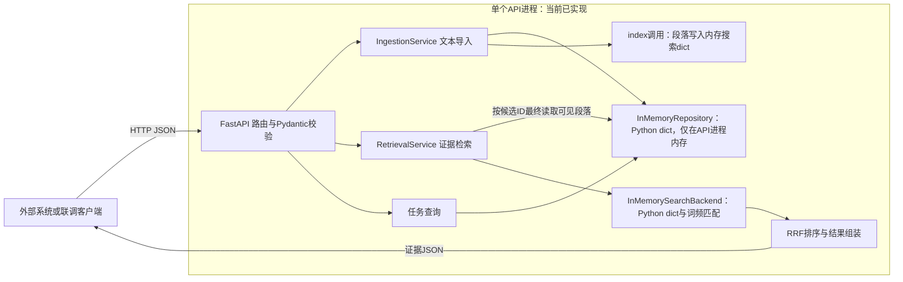
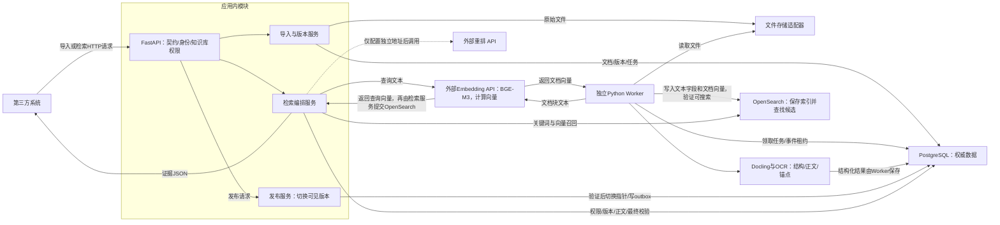
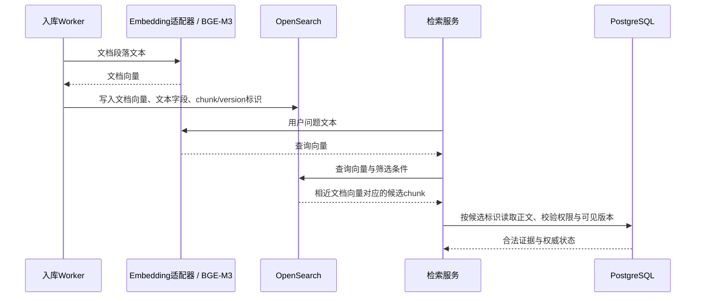
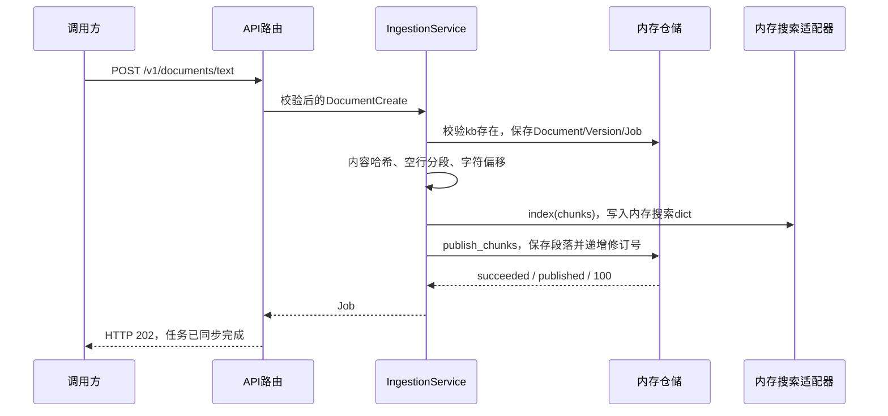
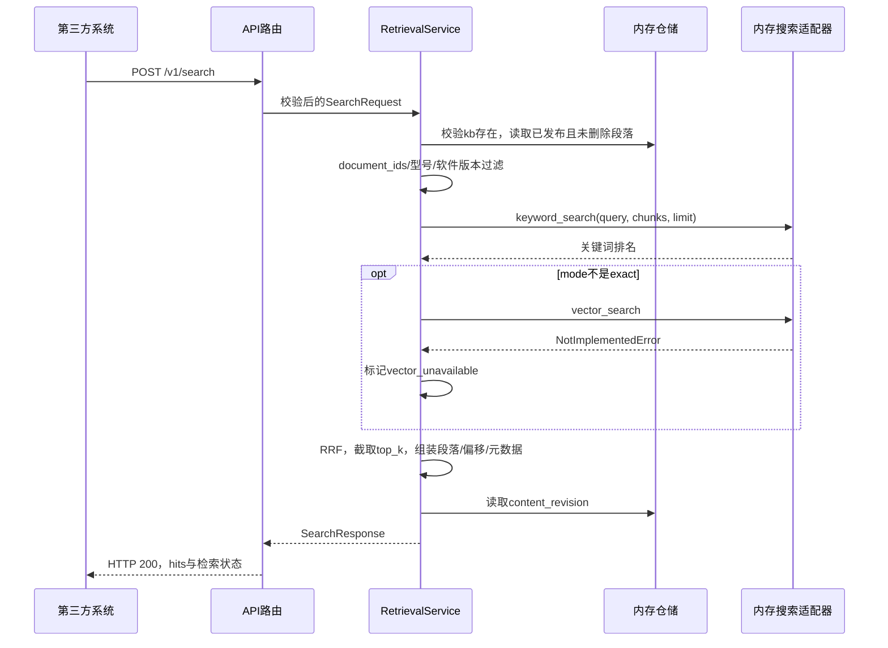
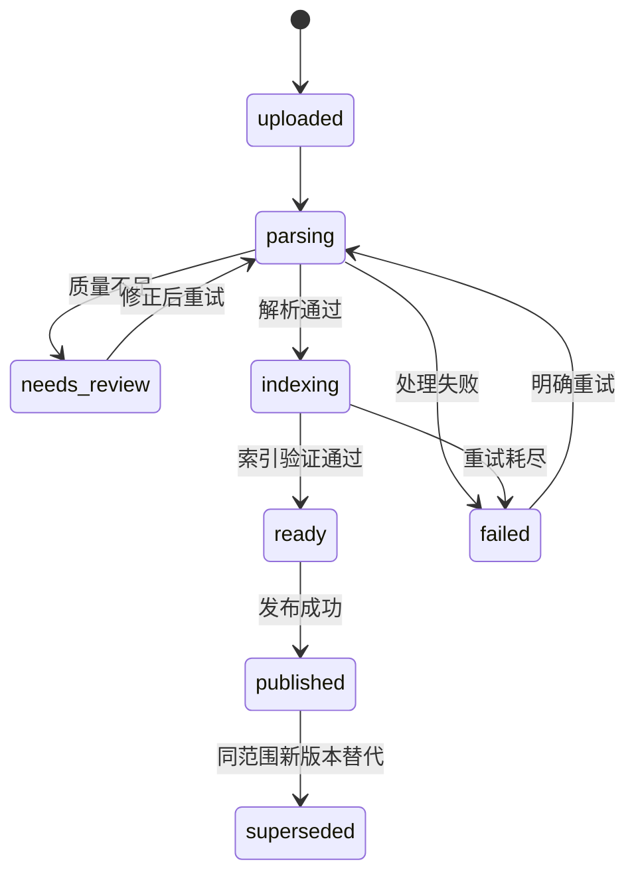

# CueKB · 线索知识库系统设计方案

版本：v0.1｜状态：M0 / M1 / M2 编码已完成｜日期：2026-09-15。

本稿是内部开发主文档。第2节说明已实现架构、组件职责和两条数据流；第10节提供当前源码导航。每个尚未编码的能力明确标记为**待开始**或**待确认**。对外当前接口见[API接入说明](API_GUIDE.md)，完整编码状态见[任务板](../TASK_BOARD.md)。

## 1. 目标与范围

### 1.1 产品定义

CueKB是一套证据检索服务。输入自然语言问题与可信访问身份，输出排序后的原文证据、适用条件、来源定位及本次检索状态。快速、准确高于图谱规模或拟脑程度。

保留人脑启发的三个功能：多个线索定位同一内容；利用时间/项目/型号情境避免混淆；在明确需要时扩展关联。暂不模拟神经活动、自动遗忘、复杂记忆重组或自发推理。

### 1.2 两种用途

| 用途 | 内容 | 接入与运行 |
| --- | --- | --- |
| 生产客服 | 产品手册、故障知识、版本通告、处理流程 | 客服Agent通过API；发布与权限严格控制 |
| 个人知识库 | 导出的聊天、项目设计、决策记录、笔记 | 本地独立实例；使用已完成的内置门户；模型与解析均本地时可离线 |

共用核心实现，数据实例独立。当前通过文件导入；外部平台连接器状态为**待确认**。

### 1.3 首期与后续

**已完成**：PDF/DOCX/MD/TXT、扫描PDF OCR、基础质量门禁、API、版本/权限、关键词/向量/RRF/重排、原文定位、更新和删除。

**待开始**：轻量关系、完整上下文、证据状态评估、质量评测工具和运行指标。

**待确认**：LLM回答、文档级ACL、外部平台同步及更复杂查询。DOC旧格式、复杂图形理解、图片/视频语义检索、全自动知识图谱和生产故障动作执行不在当前范围。

## 2. 内部开发视图：架构、组件与数据流

本节是开发人员的架构入口。2.1说明开发模式，2.2说明已完成编码的生产模式，2.4/2.5分别说明语料入库和第三方检索。图中的模块是逻辑职责，不代表各自都是独立微服务。完整状态统一在[TASK_BOARD](../TASK_BOARD.md)，对外当前契约单独维护在[API接入说明](API_GUIDE.md)。

### 2.1 当前开发模式运行架构（2026-09-15）



设置`CUEKB_BACKEND=memory`时仅需Python应用依赖；不会访问PostgreSQL、OpenSearch、文件存储或模型。该模式用于快速单元/API测试，进程退出数据丢失，多worker不共享数据，也不代表生产权限与发布行为。

#### 2.1.1 “内存仓储”具体是什么组件

**它是本项目自己实现的Python类`InMemoryRepository`，既不是PostgreSQL，也不是OpenSearch，更不是二者的缓存层。** 实现在[`src/cuekb/adapters/memory.py`](../src/cuekb/adapters/memory.py)。

该类把知识库、文档、版本、任务和段落分别放在`knowledge_bases`、`documents`、`versions`、`jobs`、`chunks`五个Python `dict`中。数据驻留于运行FastAPI的进程内存，没有写入数据库或磁盘。这里的“仓储”指应用读写业务对象的代码接口，不是某个数据库产品的名称。

同文件的`InMemorySearchBackend`是**另一个类**：`index()`把段落写入自己的Python `dict`，检索时直接进行关键词评分；它没有外部索引服务，也不会调用Embedding。不要把“内存仓储”和“内存搜索”合并理解为一个数据库组件。

| 工作 | 开发模式由谁执行 | 生产模式由谁执行 |
| --- | --- | --- |
| 保存/读取知识库、文档、版本、任务和正文 | `InMemoryRepository`中的Python dict | 生产模式由已实现的PostgreSQL仓储接管，并执行权限、事务与发布协议 |
| 建索引、按关键词查候选 | `InMemorySearchBackend`的Python dict与词频匹配 | 生产模式由OpenSearch适配器建立索引并执行BM25召回 |
| 将文本转换成向量 | 内存模式不执行 | 生产模式通过外部Embedding API执行 |
| 保存向量、按向量找相近候选 | 内存模式不执行 | 生产模式由OpenSearch向量字段与k-NN检索执行 |
| 保存上传的原始文件 | 内存模式不执行 | 生产模式由文件存储适配器执行 |

生产接入不是“把内存改成PostgreSQL”这一项开关，而是分别装配权威仓储、搜索引擎、文本编码和文件保存。当前[`api/dependencies.py`](../src/cuekb/api/dependencies.py)根据`CUEKB_BACKEND`选择内存或生产适配器；外部模型配置由PostgreSQL读取。未配置Embedding时生产服务可以启动，导入与检索返回409，且不会静默回退内存模式。

### 2.2 已完成编码的生产架构



应用采用模块化结构，API与独立Worker共享领域模型；解析器是Worker调用的库，不要求另建解析微服务。Embedding和重排均使用项目外部的独立服务地址；Embedding配置完成后才接受导入/检索，重排地址为空时不调用重排。CueKB不构建、运行或保存任一模型的权重。普通检索不调用生成式LLM。

#### 2.2.1 PostgreSQL、OpenSearch与Embedding是什么关系

三者分别承担**权威数据保存、搜索索引与候选检索、文本向量计算**。生产代码和Compose已经完成该分工。

| 名称 | 它是什么 | 具体输入→输出 | 数据责任 |
| --- | --- | --- | --- |
| PostgreSQL | 数据库服务 | 业务对象写入/读取与事务校验→权威正文、权限、可见版本等 | 决定内容及其状态，以此校验结果能否返回 |
| Embedding（基线BGE-M3） | 将文本编码为数值向量的模型能力，通过适配器调用 | 段落或问题文本→一组浮点数构成的向量 | 负责计算，不承担本项目知识库的持久化或搜索索引保存 |
| OpenSearch | 搜索引擎服务 | 写入文本/文档向量→搜索索引；关键词/查询向量→候选内容块及相关性排名 | 保存可重建的检索副本，包括向量；不代替PG裁决权限或可见版本 |

“Embedding”既可指文本编码过程，也常指其输出的向量。本项目图中`Embedding适配器`表示模型调用组件，`文档向量`/`查询向量`表示返回的数据。BGE-M3是选用的编码模型，OpenSearch是保存并检索编码结果的搜索引擎；两者不是同一个组件。

#### 2.2.2 外部模型 API 契约

CueKB只作为客户端调用模型服务。系统管理员通过门户提交Embedding和可选Reranker各自的`base_url`、`api_key`和`model`三元组；API和Worker从PostgreSQL读取最新配置。`base_url`必须以`/v1`结尾且不含末尾斜杠；运行方负责TLS、网络访问控制、鉴权代理、模型部署、容量、健康检查和权重生命周期。模型API Key以`pgcrypto`加密保存，`CUEKB_MODEL_CONFIG_KEY`是部署环境中独立的稳定加密密钥；管理API只返回密钥是否已设置，不回显明文。

| 能力 | 请求 | 成功响应 | CueKB校验 |
| --- | --- | --- | --- |
| Embedding（导入/检索前必配） | `POST {embedding_base_url}/embeddings`，Bearer `api_key`，`{"model":"...","input":["..."],"encoding_format":"float"}` | OpenAI `{"model":"...","data":[{"index":0,"embedding":[...]}]}` | 返回model必须等于配置model；按`index`还原输入顺序；每条输入应有一条向量，向量维度由OpenSearch映射校验 |
| Rerank（可选） | `POST {reranker_base_url}/rerank`，Bearer `api_key`，`{"model":"...","query":"...","documents":["..."]}` | OpenAI-compatible `{"model":"...","results":[{"index":0,"relevance_score":0.9}]}` | 返回model必须等于配置model；按`index`还原输入顺序；每个候选应有一个分数 |

Embedding遵循 OpenAI `POST /embeddings` 契约；重排不是 OpenAI 官方端点，采用 vLLM 等 OpenAI-compatible 服务使用的`POST /rerank`扩展。服务应以非2xx表达鉴权、限流或不可用；CueKB按既有deadline处理为向量或重排降级，绝不回退为项目内推理。若需要其他第三方协议，必须在`model_client.py`增加明确适配器，不能把第三方响应泄漏到核心检索逻辑。

**已完成向量路径中的调用与数据传递：**



图聚焦向量与存储关系，发布门禁、融合、重排和最终一致性顺序仍按2.4/2.5及第4/5节执行。**本项目由Worker/检索服务调用Embedding后将向量交给OpenSearch**，没有设计成OpenSearch直接调用模型。应用根据相同chunk/version标识关联PG正文和OpenSearch索引。

关键词检索是另一条路径：`查询文本→OpenSearch BM25→关键词候选`，无需先生成Embedding。混合检索把关键词候选和向量候选交给RRF融合；只有完整配置Reranker的`base_url`、`api_key`和`model`才可能继续重排。文档向量与查询向量必须使用一致的model和编码配置；换模型需要重建匹配的向量索引。

例如，语料写“设备无法接入网络”，问题问“连不上网怎么办”：Embedding将两段文字分别编码，OpenSearch按向量相近程度寻找候选。语义相近不保证事实正确，实际命中质量需要评测；权限与版本仍由PG校验。

### 2.3 组件依赖、分工与实现边界

下表的“代码状态”只使用任务板定义的三种状态。一个组件包含后续能力时拆成独立行，不用“部分实现”描述。

| 组件/依赖 | 入库时负责什么 | 检索时负责什么 | 代码状态 | 代码依据 |
| --- | --- | --- | --- | --- |
| Uvicorn / FastAPI / Pydantic | 接收HTTP并校验输入 | Bearer API Key、ACL和响应契约 | **已完成** | `api/routes.py`、`schemas.py` |
| 内置管理门户 | 面向管理员提供导入、任务、版本、原文、删除和检索验证页面；系统管理员配置外部模型 | 仅保存标签页级API Key，所有操作继续执行API ACL | **已完成** | `portal/`、`main.py` |
| 导入与版本服务 | 文件、版本、幂等任务和发布 | 不执行在线召回 | **已完成** | `api/routes.py`、`adapters/postgres.py` |
| 检索编排服务 | 不处理上传解析 | exact/hybrid路由、并行召回、RRF、重排和最终校验 | **已完成** | `services/retrieval.py` |
| Repository / SearchBackend端口 | 隔离业务存储和索引 | 隔离正文读取和候选召回 | **已完成** | `ports.py` |
| 内存仓储与搜索 | 开发模式dict存储和同步导入 | 开发模式词频匹配 | **已完成** | `adapters/memory.py` |
| PostgreSQL / Alembic | 权威正文、版本、ACL、任务和outbox | 权限、删除和可见版本最终裁决 | **已完成** | `adapters/postgres.py`、`migrations/` |
| 文件存储适配器 | 原文件按哈希原子保存 | 经授权下载并校验路径边界 | **已完成** | `adapters/storage.py` |
| Python Worker | 租约、续期、解析、投影、幂等和退避 | 不参与在线请求 | **已完成** | `worker.py` |
| Docling / OCR | PDF/DOCX结构、表格、正文和锚点 | 不在查询时解析 | **已完成** | `services/parsing.py` |
| 基础质量与分块 | 空内容、UTF-8和替换字符门禁；有界chunk | 提供标题和来源定位 | **已完成** | `services/parsing.py` |
| 外部Embedding API / BGE-M3 | 文档块编码 | 非exact查询编码 | **已完成** | `model_client.py` |
| OpenSearch | 写入CJK BM25和向量投影 | BM25/k-NN候选召回 | **已完成** | `adapters/opensearch.py` |
| RRF融合 | 不处理语料 | 有界候选融合与去重 | **已完成** | `services/retrieval.py` |
| 外部重排 API | 不处理入库向量 | 地址未配置时跳过；配置后按deadline、路径和负载处理有限候选 | **已完成** | `model_client.py`、`services/retrieval.py` |
| 发布服务 / outbox | ready、手动/自动发布和清理事件 | PG只加载当前发布版本 | **已完成** | `adapters/postgres.py`、`worker.py` |
| 关系DDL | 定义实体、别名、关系和证据表 | 不提供查询行为 | **待开始** | M3统一建立DDL和应用服务 |
| 关系写入与一跳扩展 | 写入有出处的关系 | `related`有界一跳扩展 | **待开始** | M3 |
| 完整上下文组装 | 建立父章节和表格上下文 | 补相邻步骤、表头和单位 | **待开始** | M3 |
| 对象存储适配器 | 保存原文件 | 原文下载 | **待确认** | 存储产品和保留策略尚待确认 |

表中源码短路径均相对于`src/cuekb/`。Compose会运行迁移、API、Worker、PG和OpenSearch；模型服务在Compose之外，内部数据服务不映射宿主机端口。确切依赖见`pyproject.toml`；不引入Neo4j、Redis、独立向量数据库或分布式消息队列。

### 2.4 语料进入系统后如何流转

**开发模式路径：同步文本导入。**



该开发路径直接标记`published`，不执行生产发布协议。哈希虽有记录，但重复提交仍产生新文档；没有幂等键处理。完整上传内容没有作为原文件保存，只有分段正文和元数据进入内存。它只用于快速开发测试。

**已完成的生产路径：上传、后台入库、发布分离。详细状态与一致性规则见第4节。**

| 顺序 | 负责组件 | 输入→输出/数据落点 | 对调用方或可见性的影响 |
| --- | --- | --- | --- |
| 1 | API、身份/权限、导入服务 | 文件＋元数据＋幂等键→校验授权/格式/大小，原文件存文件适配器，文档/版本/任务存PG | 返回任务ID；上传成功尚不可检索 |
| 2 | Worker、Docling/OCR | 从PG领取租约，读取原文件→正文、章节、表格、来源锚点 | 进度写PG；失败或质量不足不发布 |
| 3 | 质量与分块模块 | 解析结果→基础质量状态、有界chunks、标题路径和来源锚点 | 权威正文与定位存PG；空内容和无效文本不发布 |
| 4 | Worker、Embedding、OpenSearch | chunks→文档向量＋关键词/向量投影；模型配置可追溯 | 索引是派生数据；即使能召回，未发布也不返回 |
| 5 | Worker、索引验证 | 数量、哈希、维度、模型配置和可搜索检查→ready | ready表示可发布，不等于已对外可见 |
| 6 | 发布服务、PG | 确认发布→事务切换当前唯一default版本指针，递增修订号并写outbox | 此时通过最终校验的版本才能对外返回 |
| 7 | Worker、OpenSearch | 消费outbox→更新投影、退出旧版本、触发派生失效 | 同步延迟不能放宽PG最终权限/版本约束 |

生产默认由明确发布操作控制可见范围；个人实例可配置质量通过后自动发布。两者都不能越过质量门禁。文件存储保存原件、PG保存权威内容与状态、OpenSearch保存搜索副本，三者分工不能相互替代。

### 2.5 第三方发起检索后如何流转

**开发模式路径：进程内关键词检索。**



开发模式读取修订号只是返回字段，不执行完整事务快照比较。`auto`已按确定性标识符规则选择exact或hybrid，但内存模式没有模型，hybrid会显式标记向量降级。`related`关系扩展代码状态为**待开始**。

**已完成的生产路径：候选召回、可选重排、版本切换重试与最终证据校验。预算及降级见第5节。**

| 顺序 | 负责组件 | 处理与数据去向 | 必须保留的边界 |
| --- | --- | --- | --- |
| 1 | API、身份适配器、PG | 从可信凭据得到身份，校验kb访问范围，读取修订号/索引generation | kb_ids本身不是权限凭据；校验失败拒绝返回正文 |
| 2 | 检索编排 | 规范query与业务范围，选择exact/hybrid/related路径 | 不调用生成式LLM猜身份或范围 |
| 3 | OpenSearch；Embedding适配器 | 关键词召回；并行query编码→向量召回 | 两路共享过滤范围，query与文档编码配置一致 |
| 4 | 检索编排/RRF | 合并排名、按chunk ID去重、保留有限候选 | 不把相似分数当事实概率 |
| 5 | 重排适配器、检索编排、PG正文 | 配置重排地址时，query＋有限候选正文→可选重排；否则保留RRF顺序 | 重排不生成答案；当前context返回命中段落 |
| 6 | PG最终校验、检索编排 | 重排后重新加载候选，检查权限、删除、default版本和内容修订 | 失效内容剔除；修订变化最多重试一次，不放宽权限凑数量 |
| 7 | API | 输出原文证据、定位、适用条件、执行/证据状态 | 第三方决定如何展示或接入自己的回答生成流程 |

查询阶段不再运行Docling/OCR；Worker不在每个在线请求中执行。OpenSearch先找候选，PG最终决定哪些候选可以返回。关键词、向量和重排各自只承担检索职责。关系扩展和完整上下文代码状态为**待开始**；生成式回答代码状态为**待确认**。

## 3. 领域数据模型

### 3.1 核心对象

| 对象/表名 | 关键字段与约束 | 代码状态 |
| --- | --- | --- |
| knowledge_bases | id、名称、acl_revision、content_revision | **已完成** |
| principals / api_keys / kb_grants | 身份、凭据哈希、知识库read/write/admin授权；不保存明文Key | **已完成** |
| documents | id、kb_id、逻辑文档名、deleted_at | **已完成** |
| document_versions | id、document_id、原文hash、来源、业务版本、适用范围和状态 | **已完成** |
| document_publications | document_id、scope_key、active_version_id；当前仅允许`default` | **已完成** |
| sections表定义 | id、version_id、parent_id、标题路径、顺序和完整内容 | **已完成** |
| sections完整层级写入 | 将解析层级写入sections并关联chunks | **待开始** |
| chunks | id、section_id、version_id、原文、检索文本、来源锚点和hash | **已完成** |
| ingestion_jobs | 阶段、租约、重试次数、幂等键、错误和进度 | **已完成** |
| outbox_events | 与内容变更同事务写入；消费者幂等执行派生更新 | **已完成** |
| entities / entity_aliases / mentions | 实体、别名及原文位置 | **待开始** |
| relation_assertions / relation_evidence | 有出处关系、条件、支持或反驳证据 | **待开始** |
| index_generations | 模型、维度、分块版本及索引切换记录 | **待开始** |
| model_configurations | 单实例外部Embedding/Reranker地址、模型标识、加密凭据与修订号 | **已完成** |
| audit_events / search_traces | 管理操作和持久化检索诊断 | **待开始** |

实体、文档、块使用稳定内部ID。不同文档具有相同正文时不合并权限边界；字节去重可在文件层发生，业务记录仍独立。

### 3.2 内容粒度

文档→章节→内容块。当前解析器按段落/结构项生成块，单个长文本按最多1200字符切分，并保存标题路径和来源锚点。Tokenizer级200—450 tokens分块及滑窗策略代码状态为**待开始**。

完整父章节、相邻步骤、表头/单位补充和总上下文预算的代码状态为**待开始**。当前响应的`context`复制命中段落。OCR不确定、阅读顺序错误和表头丢失的高级质量规则代码状态为**待开始**。

`source_text`保持解析所得原文；`search_text`可增加标题和规范别名。自动生成关键词或描述不冒充原文；引用始终指向原始证据。

### 3.3 原文定位

PDF保留页码、区域坐标及坐标系；DOCX/MD/TXT保存标题路径、段落/行或字符定位；DOCX无稳定页码时不得伪造页码。多页块允许多个锚点。

### 3.4 适用范围

产品型号、软件版本、项目、有效起止时间与资料上传时间分开。版本用原始字符串加经过业务验证的规范字段，禁止简单字典序比较`1.10`和`1.9`。未知型号/版本不推测成硬过滤。

当前实现只允许每个逻辑文档一个`default`发布版本，产品/软件范围通过版本元数据和显式filters校验。多`scope`发布状态为**待确认**；在请求无法表达scope前不开放多个发布指针。

## 4. 入库、发布与一致性

### 4.1 入库步骤

已完成的入库步骤：

1. 校验上传身份、格式/大小、知识库权限和幂等键，保存原文件哈希及任务。
2. Worker领取租约，解析/必要OCR，生成正文、标题路径和来源锚点。
3. 检查空内容、无效UTF-8和高比例替换字符；失败内容不发布。
4. 生成有界chunks和Embedding，保存正文与编码配置，构建关键词和向量投影。
5. 验证索引写入和向量维度，进入`ready`。
6. 发布服务更新权威版本指针和内容修订号，写入outbox，驱动旧版本或删除投影清理。

页覆盖、复杂表格质量、完整章节层级、关系和别名处理代码状态为**待开始**。

默认入库与发布分离。首期以知识库级发布操作控制正式可见范围；个人实例可配置“质量检查通过后自动发布”，不能绕过质量检查。

### 4.2 状态



删除是独立的文档可见性状态，优先级高于上述版本状态；不需要等待所有后台清理完成才停止返回。

### 4.3 发布协议

PostgreSQL与OpenSearch不存在跨库原子事务，采用可重试发布协议：

1. 为新版本写完整候选索引，等待refresh并验证能搜到；此时PG尚未指向新版本，最终校验不会返回它。
2. 新版本进入可召回集合时允许新旧索引短暂共存，按文档分组控制挤占，保留必要过取候选预算。
3. PG事务切换该scope的`active_version_id`，递增`content_revision`并记录outbox。只有完成前置可搜索验证才允许切换。
4. 后台将旧版本退出常规可召回集合；即使同步延迟，最终PG校验也不允许返回旧版本。
5. 每次查询保存初始修订号，重排后从PG重新加载所有候选并再次读取修订。期间发生修订时最多重试一次；持续更新则再过滤一次当前合法候选并返回`index_transition`降级，不混用同一文档版本。

跨全部读取步骤的单事务快照增强代码状态为**待开始**。

该方案保证不返回权威状态已失效内容，不能保证发布窗口召回与延迟完全不受影响。过滤造成候选不足时在预算内补取一次；禁止通过放宽权限或版本约束凑满top_k。

### 4.4 更新与删除

- 同幂等键＋相同payload返回原任务；相同键不同payload返回冲突。幂等键按身份和知识库作用域隔离。
- 同一逻辑文档使用新版本记录；同一`document_id`与文件hash的重复版本由数据库唯一约束拒绝。
- 当前更新按整个文件重新解析，不重建整个知识库。
- 查询和文档向量校验模型标识及维度，不允许混用不兼容向量。
- 删除/撤权先写PG权威状态和内容修订，再由outbox异步清理OpenSearch。所有返回与下载执行最终校验。

自动化index generation切换和回退代码状态为**待开始**。关系证据级删除依赖M3，代码状态为**待开始**。硬删除、备份到期清理和保留策略状态为**待确认**。

### 4.5 Worker可靠性

任务租约、心跳、故障重领、确定性chunk ID、有限重试和退避代码状态为**已完成**。批量入库与在线模型的独立队列或资源配额代码状态为**待开始**。

## 5. 查询设计

### 5.1 请求入口

输入query、kb_ids、top_k、显式filters和mode。身份从可信凭据解析，不能信任客户端传入tenant_id/user_id作为权限。默认单轮检索；“那一个”“上次那个方案”需要调用方传递已确定上下文，否则返回需要澄清的状态，不偷偷用LLM猜测。

### 5.2 路由

| 模式 | 选择条件 | 当前行为 | 代码状态 |
| --- | --- | --- | --- |
| exact | 调用方指定，或auto识别为完整标识符 | BM25短路径，跳过Embedding和重排 | **已完成** |
| hybrid | 调用方指定的自然语言检索 | BM25与向量并行、RRF；配置重排地址后可选重排 | **已完成** |
| related | 调用方请求关系查询 | 当前执行hybrid并返回`scope_limited=true` | hybrid回退**已完成**；一跳扩展**待开始** |
| auto | 调用方默认值 | 确定性正则选择exact或hybrid | **已完成** |

精确查询不只是“识别到了错误码”就跳过其他条件。相同错误码在不同产品存在时，结合明确型号或返回分组和歧义。调用方可通过`mode`明确选择；`auto`的标识符正则来自配置。重排先检查PostgreSQL中是否配置Reranker地址，地址为空时直接跳过；地址存在时继续使用总deadline、模型超时、候选数、最低剩余预算和开关等原有策略。

### 5.3 普通查询步骤与初始参数

已完成的查询步骤：

1. 解析身份、知识库权限和显式filters，读取权威内容修订。
2. 按调用方mode或确定性标识符正则选择exact/hybrid路径。
3. BM25召回有界候选；非exact路径并行计算query向量并执行向量召回。
4. RRF按chunk ID融合去重，从PG加载当前发布、未删除且仍有权限的正文。
5. 非exact路径仅在重排地址已配置、开关启用、候选足够且剩余deadline充足时对有限候选重排；否则保留RRF顺序并记录跳过原因。
6. 重排后再次从PG加载候选；内容修订变化时最多重试一次，再次变化则过滤并返回`index_transition`。
7. 返回默认8个、最多20个证据；`context`当前复制命中段落；`evidence_status`当前为`unassessed`。

审核别名词典、related一跳扩展、Tokenizer级截断策略、完整上下文预算和证据状态评估代码状态为**待开始**。候选数、deadline和重排门槛是配置值，不代表最佳参数。

### 5.4 排序与过滤

OpenSearch的CJK text字段、文档/版本/知识库keyword字段和元数据filters代码状态为**已完成**。独立行业词典代码状态为**待确认**。

RRF只融合排名，不把BM25分数和余弦分数直接相加。默认最终顺序使用RRF；配置重排地址并实际执行后，有限候选按重排相关性排序。权威来源和状态仍是明确约束，历史查询放宽版本范围必须显式请求，但权限不变。

### 5.5 轻量关系

轻量关系DDL、写入服务、管理接口和一跳查询代码状态为**待开始**。拟支持的关系包括belongs_to、adjacent_to、alias_of、revises、replaces、references，以及有证据且通过校验的depends_on/applies_to。

M3实现时，相似文本只能作为召回线索，不能自动变为因果/依赖关系。关系扩展必须回到原文，按问题的关系类型、时间和方向筛选，并限制一跳、数量和时间。对“全部影响范围”明确`scope_limited=true`，不得将受限一跳结果标为完整。

### 5.6 超时与降级

| 故障 | 行为 |
| --- | --- |
| Embedding或向量检索超时/模型不匹配 | 返回BM25合法候选，标记vector_unavailable |
| 未配置重排服务地址 | 不调用重排，保留RRF结果并记录reranker_service_unconfigured |
| 重排超时 | 返回RRF合法结果，标记rerank_unavailable |
| 关联超时 | 关系扩展代码状态为**待开始**；该降级行为随M3实现 |
| OpenSearch不可用 | 返回503，不冒充正常无结果 |
| 身份/PG最终权限校验失败 | 拒绝返回内容，不能以缓存绕过 |
| 无合法候选 | 返回空列表与not_found状态，区分后端故障 |

deadline预算、模型调用超时、OpenSearch请求超时、重排地址/剩余预算门禁和模型429过载响应代码状态为**已完成**。覆盖PG及所有子任务的硬截止取消代码状态为**待开始**；当前`search_deadline_ms`用于模型超时与重排决策，不应解释为整个HTTP请求的强制中止时刻。

### 5.7 证据与置信

`evidence_status`可为unassessed、sufficient、insufficient、conflicting；`retrieval_status`可为ok、degraded、not_found、needs_clarification；两者独立。未标定的模型分数不能使状态自动变成sufficient。

证据状态评估代码状态为**待开始**。M4将用独立验证集标定低证据门槛，评估误报和漏报，并实现冲突检测、`assessment_method`和`conflict_check_scope`。当前`unassessed`不能解释为证据充分。

## 6. API契约与状态

本节列出当前和后续接口。精确字段与示例见[API接入说明](API_GUIDE.md)，运行契约见`/openapi.json`。

### 6.1 当前接口集合

| 方法与路径 | 功能 | 当前状态 |
| --- | --- | --- |
| GET /v1/health、GET /v1/ready | 存活与PG/OpenSearch就绪检查 | 已实现 |
| POST /v1/knowledge-bases | 创建知识库 | 已实现，生产仅system admin |
| POST /v1/documents | multipart上传或用`document_id`追加新版本；返回202任务ID | 已实现 |
| POST /v1/documents/text | 直接提交UTF-8文本 | 已实现 |
| GET /v1/knowledge-bases | 返回当前身份可访问知识库和角色 | 已实现 |
| GET /v1/documents | 按知识库分页返回可见文档及版本摘要 | 已实现 |
| GET /v1/documents/{id} | 返回文档及全部版本详情 | 已实现 |
| GET /v1/jobs/{id} | 当前阶段、进度和错误 | 已实现 |
| POST /v1/documents/{id}/publish | 发布ready版本；当前scope_key只允许default | 已实现 |
| GET /v1/documents/{id}/source | 经授权下载当前或指定版本原文 | 已实现 |
| DELETE /v1/documents/{id} | 立即隐藏并启动索引清理 | 已实现 |
| POST /v1/search | 证据检索 | 已实现 |
| POST/DELETE /v1/api-keys、PUT/DELETE /v1/knowledge-bases/{id}/grants | API Key与知识库ACL管理 | 已实现 |
| 关系管理与查询接口 | 实体、关系和一跳扩展 | **待开始** |
| POST /v1/answer | 可选生成式回答 | **待确认** |

API使用OpenAPI描述。导入支持`Idempotency-Key`。当前错误响应使用FastAPI的`detail`字段，搜索成功响应提供`trace_id`；统一错误`error_code/trace_id`代码状态为**待开始**。400/422表示输入问题，401表示凭据问题，403表示权限不足，409表示版本/幂等冲突，503表示PG或OpenSearch不可用。

### 6.2 搜索请求示例（当前契约的示例值）

```json
{
  "query": "设备升级后漫游容易断开，有哪些检查步骤？",
  "kb_ids": ["kb_example"],
  "mode": "auto",
  "top_k": 8,
  "filters": {
    "product_model": "MODEL_X",
    "software_version": "V2.1",
    "version_policy": "applicable_current"
  },
  "include_context": true
}
```

示例型号和版本是占位内容，不代表真实设备故障。

### 6.3 搜索响应字段

| 字段 | 内容 |
| --- | --- |
| trace_id | 单次请求跟踪ID |
| retrieval_status / degraded_reasons | 执行结果与缺失路径 |
| evidence_status | 当前固定为unassessed；证据评估规则代码状态为**待开始** |
| scope_limited | related路径当前标记true；关系扩展代码状态为**待开始** |
| content_revisions | 各知识库当前权威内容修订 |
| timings_ms | 总耗时与各阶段耗时；普通客户端可只看总耗时 |
| retrieval_path / executed_stages / skipped_stages | 路由选择和实际执行/跳过的Embedding、向量与重排阶段 |
| hits[] | chunk_id、document_id、version_id、标题路径、source_text、context、适用范围、锚点和授权查看入口 |
| hits[].retrieval_sources | keyword/vector/relation等候选来源 |
| hits[].rank | 最终名次；原始分数只在有权限debug中提供 |

客户端query不能覆盖服务端身份。调用方请求的kb_ids必须属于实际授权范围，未授权请求不能返回任何该库内容。

## 7. 安全与数据边界

知识库级read/write/admin代码状态为**已完成**。文档级ACL代码状态为**待确认**。当前不同可见范围应建立不同知识库；个人实例可用单一owner身份，但不可把无认证端口直接暴露到公网。

API Key哈希、吊销和知识库ACL代码状态为**已完成**。OIDC身份适配代码状态为**待确认**。

应用级检索缓存代码状态为**待确认**。如果后续引入，缓存键必须包含身份授权指纹、kb集合、内容修订、规范query、显式filters、mode、模型和排序配置；缓存命中后仍须执行权威权限与版本校验。

限制上传格式/大小与解析资源，拒绝路径穿越和任意远端URL抓取。原文属于不可信输入；未来回答模块把它作为数据而非指令，不能因文档内容越权调用工具。

模型接入安全控制代码状态为**已完成**：只有系统管理员可通过管理接口修改外部模型配置；Embedding三元组保存后才允许导入/检索，Reranker地址存在时也必须有完整三元组；普通检索接口不接受客户端传入模型路径、服务地址、模型名称或凭据；模型服务自身的TLS、凭据、网络策略和权重安全由外部部署负责；CueKB容器继续使用非root用户。

## 8. 部署与资源策略

### 8.1 本地

当前Compose包含api、worker、postgres和opensearch，支持单机运行及数据库、索引和原文持久化；Embedding与重排是该Compose之外的服务。

Compose部署代码状态为**已完成**：包含迁移门禁、API、Worker、PostgreSQL、OpenSearch及持久卷；API和Worker镜像先由操作员手动`docker build`，Compose只引用本地镜像；模型配置从门户写入PostgreSQL，未配置时服务仍可启动且API不会回退内存。步骤见[README](../README.md)。

用户16GB M4机器不能在无实测情况下保证外部模型服务、OpenSearch和开发工具同时满足1秒目标。可选择与CueKB网络隔离部署的质量基线模型服务，或使用轻量中文Embedding、减少重排候选并单独验收。严格离线时外部模型与OCR权重需提前下载，禁用远程推理。

轻量配置仍用相同适配器，但Embedding模型和索引不能与质量基线混用。重排默认关闭；配置独立地址后才加载并调用，其执行或跳过原因会出现在响应中。

### 8.2 生产

当前部署代码提供单机Compose。多副本、高可用、PG/OpenSearch副本、RTO/RPO和对象存储状态为**待确认**；单机Compose不表示高可用。备份以PG与原文为核心，OpenSearch索引可重建。

外部模型服务容量依据输入长度、每请求候选数、QPS和排队延迟测量。不能用“100用户在线”代替100 QPS，也不能只用权重大小估算吞吐。

### 8.3 可观测性

搜索响应的query编码、关键词/向量搜索、可选重排和总耗时，以及执行/跳过阶段和降级原因，代码状态为**已完成**。持久化指标、关系/上下文耗时、任务积压、模型队列、发布延迟、告警和运行看板代码状态为**待开始**。日志默认隐藏完整正文和凭据。

## 9. 验收与性能

### 9.1 验收口径

以下性能门槛状态为**待确认**。确认后，检索时间从API收到请求到完整证据JSON返回，包含鉴权、查询Embedding、重排和最终校验，不含文件导入或LLM回答生成。

| 指标 | 初始设计目标 | 条件/限制 |
| --- | --- | --- |
| exact P95 | ≤300ms | 标识明确；非伪造空结果的快路径 |
| hybrid P95 | ≤1000ms | 默认混合检索；配置重排时分别统计启用重排的请求 |
| related P95 | ≤2000ms | 有限一跳，不是完整影响分析 |
| 可回答问题前5命中率 | ≥90% | 至少一个有效支持证据；与多证据指标分开 |
| 候选证据宏平均召回率 | ≥95% | 以标注证据集合为分母；固定候选预算 |
| 多证据全部覆盖率@8 | ≥85% | 所需证据单元不超过8；可接受等价证据须预先标注 |
| 无答案误报为sufficient | ≤5% | 先标定；同时报告可回答问题被误判不足的比例，建议≤10% |
| 出处/版本/权限强制用例 | 全部通过 | 指标集通过不意味着现实世界绝对零错误 |
| 稳态后端错误率 | <1% | 报告429、503、超时与其他错误分布 |
| 稳态完整检索降级率 | <1% | 不能靠跳过模型达到P95目标 |

### 9.2 数据集

真实语料质量验证活动状态为**待开始**。

约200条真实问题，按明确术语、口语、型号/版本、否定/数值、表格、关联、多证据、无答案和权限分类。人工标注支持证据及不能接受的反例，来源定位可复核。调参集与冻结测试集分开，同一文档家族/同义问题尽量避免泄漏。小样本无答案比例的不确定性必须报告原始计数，不能只报漂亮百分比。

重复段落合并为证据单元，避免多个近似chunk虚增召回率。关联与多证据问题按集合完整性评估，不能用单条命中替代。

### 9.3 压测条件

时延和负载验证活动状态为**待开始**，具体数据规模和QPS状态为**待确认**。

建议初始实验条件为10万内容块、5 QPS稳态和10 QPS短时负载；这是测试建议，不代表用户已有数据或确认需求。记录CPU/GPU、内存、磁盘、架构、模型精度、输入长度、候选数、网络和软件修订。

分别测冷启动/预热、并发入库/无入库；应用缓存如果确认实施，再增加缓存命中/未命中场景。稳态建议至少15分钟，负载采用固定到达速率并记录排队和请求丢弃，避免只测同步串行请求隐藏饱和。

### 9.4 消融与故障验证

质量消融、故障和恢复验证活动状态为**待开始**。

固定语料与评测问题比较BM25、向量、混合、混合＋重排、关联增强；测质量收益与新增延迟。不直接采用模型榜单代替业务评测。

必要故障测试覆盖发布中断、重复事件、Worker崩溃、索引延迟、撤权、删除、模型换型、重排超时、PG不可用和备份恢复。不存在PG权限校验时不得降级返回缓存内容。

## 10. 实际代码导航与实施顺序

| 当前路径 | 责任/状态 |
| --- | --- |
| `src/cuekb/main.py` | FastAPI应用组装 |
| `src/cuekb/api/routes.py`、`schemas.py` | 已实现的HTTP路由与请求/响应 |
| `src/cuekb/api/dependencies.py` | 按配置装配内存或生产适配器，生产不回退 |
| `src/cuekb/domain/models.py`、`ports.py` | 领域对象与最小存储/搜索端口 |
| `src/cuekb/services/ingestion.py` | 开发模式同步文本导入路径；生产文件/文本路由直接创建PG任务 |
| `src/cuekb/services/retrieval.py` | exact/hybrid路由、并行召回、RRF、有限重排、PG最终加载与降级 |
| `src/cuekb/adapters/memory.py` | 仅开发/测试的内存存储和关键词后端 |
| `src/cuekb/adapters/postgres.py`、`opensearch.py`、`model_client.py`、`storage.py` | 生产PG、搜索、模型及文件适配器 |
| `src/cuekb/worker.py`、`adapters/model_client.py`、`services/parsing.py` | 异步入库、外部模型API调用、Docling/OCR及质量分块 |
| `migrations`、`Dockerfile`、`docker-compose.yml` | 初始迁移和单机生产部署定义 |
| `db/schema.sql` | 初始DDL，不代表迁移已执行 |
| `tests/` | 本地API、检索路由、解析、生产配置门禁、密钥哈希与文件路径边界测试 |

轻量关系扩展、完整上下文、质量评测工具和运行指标代码状态为**待开始**；首期管理门户为**已完成**，生成式回答为**待确认**。现有M0、M1、M2编码状态均为**已完成**，不为匹配历史拟议目录迁移到`backend/`。

编码顺序：M0环境与版本基线（**已完成**）→M1文档/关键词（**已完成**）→M2混合/重排（**已完成**）→首期管理门户（**已完成**）→M3关系与上下文（**待开始**）→M4质量与运行能力（**待开始**）；生成式回答保持**待确认**。详细进度只在TASK_BOARD维护。

## 11. 风险与评审决策

| 风险 | 处理 |
| --- | --- |
| PDF解析错误比检索误差更大 | 首批样本人工核验，低质量进入needs_review |
| 外部模型服务时延或容量不足 | 调整服务容量或轻量配置；分别报告精度和端到端延迟 |
| 发布最终一致导致短时漏召回 | 前置索引验证、权威指针、有限补取和index_transition状态 |
| 图扩展加入大量不相关内容 | M3（**待开始**）采用有证据关系、显式路径、数量/方向/一跳限制与消融 |
| 上传时间误当业务版本 | 发布scope与业务有效性独立建模 |
| 低分被误判为不存在 | 校准前unassessed；后续用独立样本标定 |

名称、首期API优先范围与主技术方向已经确认。真实样本和生产环境验证活动状态为**待开始**；主机配置和性能测量条件状态为**待确认**。

## 12. 官方依据与核验边界

以下资料已在本次设计讨论中核对。页面能力可能随版本变化，编码前需锁定兼容版本。来源支持组件能力，不支持本项目尚未测得的延迟或准确率。

1. [OpenSearch混合检索](https://docs.opensearch.org/latest/vector-search/ai-search/hybrid-search/index/)：关键词与语义检索及融合。
2. [OpenSearch RRF](https://opensearch.org/blog/introducing-reciprocal-rank-fusion-hybrid-search/)：按候选排名融合。
3. [OpenSearch公共过滤](https://docs.opensearch.org/latest/vector-search/ai-search/hybrid-search/pre-filtering/)：公共过滤应用到子查询；注意版本要求。
4. [OpenSearch重排](https://docs.opensearch.org/latest/search-plugins/search-relevance/reranking-search-results/)：混合结果后的重排机制。
5. [Docling支持格式](https://docling-project.github.io/docling/usage/supported_formats/)：PDF、DOCX、Markdown等格式。
6. [Docling分块](https://docling-project.github.io/docling/concepts/chunking/)：层级结构与Tokenizer长度约束。
7. [BGE-M3](https://huggingface.co/BAAI/bge-m3)：稠密向量、多语言与模型配置。
8. [bge-reranker-v2-m3](https://huggingface.co/BAAI/bge-reranker-v2-m3)：候选相关性重排。
9. [轻量中文Embedding](https://huggingface.co/BAAI/bge-small-zh-v1.5)：个人轻量配置候选，长度限制需适配。
10. [PostgreSQL递归查询](https://www.postgresql.org/docs/current/queries-with.html)：层级/图查询及环路处理。
